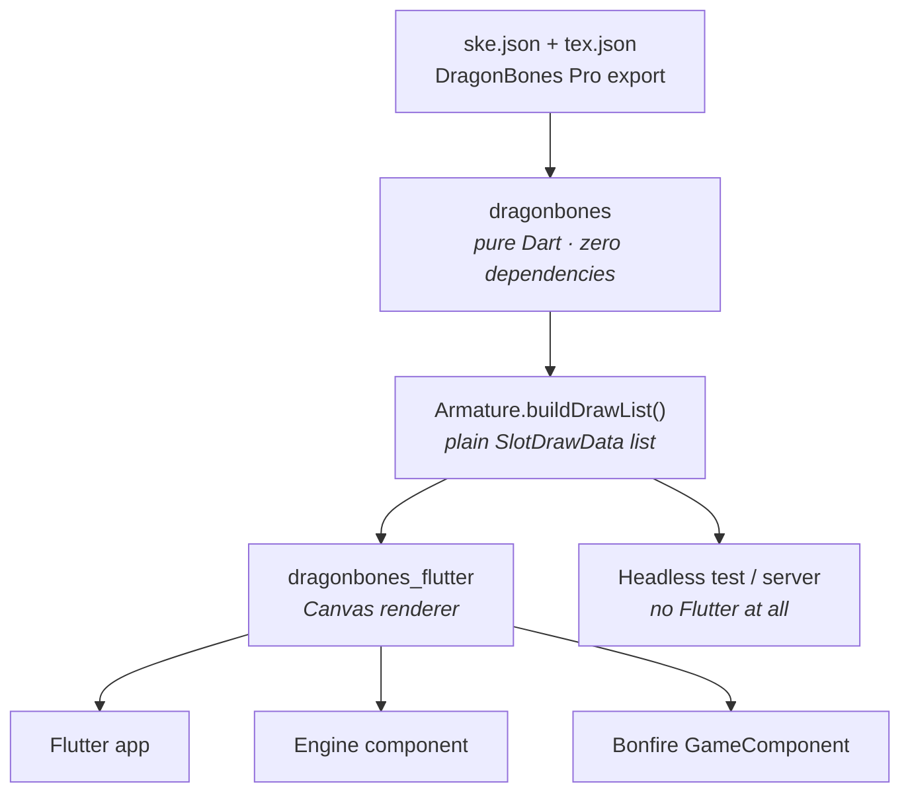
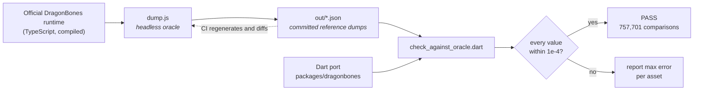

How the port is built, and — more importantly — how it is *trusted*.

## Why two packages



The split is not tidiness; it is what makes the project verifiable.

A skeletal runtime is a pile of matrix maths. Rendering is visible, so bugs in it
announce themselves. But skeletal maths **drifts silently**: a bone a few
thousandths off looks fine until a foot slides through the floor, and by then you
are staring at a sprite wondering which of the 60 bones is wrong.

If the runtime imported Flutter, verifying it would need a Flutter SDK, a device
and a GPU — and you would end up "verifying" by looking at pixels, which proves
almost nothing. Keeping the runtime dependency-free means it runs on a **bare Dart
SDK**, in CI, in milliseconds, with no GPU — and that makes a much stronger form
of verification available. See [Verification](#verification).

It also means the runtime runs on the **web** and on a **server**, with no
engine at all.

The renderer stays engine-agnostic for the same reason: it exposes
`update(dt)` + `render(Canvas)` and nothing else, so it drops into a plain Flutter
app, any game engine's component, or your own painter without the runtime (or
you) taking on a gameplay-engine dependency. The repository is named after the
renderer package because that is the one users import, but `dragonbones` is the
substrate.

## The runtime

A near-verbatim transcription of the official TypeScript runtime
(`DragonBonesJS`), reorganised into Dart files but keeping the upstream class
shapes, method names and comments where they explain behaviour.

```
lib/src/
  core/        BaseObject, DragonBones, WorldClock, enums & binary offsets
  geom/        Matrix, Transform, Point, Rectangle, ColorTransform
  model/       the 5.x data model (armature, bone, slot, skin, display,
               animation, timeline, texture atlas, user data, constraints)
  parser/      ObjectDataParser — JSON, incl. packed binary frame arrays
  armature/    Armature, Bone, Slot, TransformObject, IKConstraint
  animation/   Animation, AnimationState, timeline states, BlendState
  render/      draw_data.dart, mesh_geometry.dart
  factory/     BaseFactory, HeadlessFactory
```

Two design decisions worth knowing:

- **Render hooks are abstract.** `Slot` declares `_updateDisplay`,
  `_updateBlendMode`, `_updateZOrder` as abstract, exactly as upstream does —
  because downstream DragonBones runtimes implement them per engine. The
  renderer-side binding decides what a "display" object is. The official *core*
  never implements per-vertex mesh deformation either; that lives in the engine
  binding (`Slot._updateMesh`). This is why the mesh oracle is the **Egret
  binding** — see [Verification](#verification).
- **`Armature.buildDrawList()`** is the port's own addition and the hinge of the
  whole design. Instead of the engine binding pulling state out of slots through
  engine-specific objects, the runtime flattens the frame into a plain list of
  `SlotDrawData`: world matrix, pivot, quad size, atlas region, z-order,
  visibility, blend mode, colour, and — for meshes — posed vertices, UVs and
  triangles. Nested child armatures are flattened in, with the parent slot's
  matrix already composed onto their slots.

That last point is why the renderer is ~300 lines: by the time it runs, every
decision has been made and every number verified. `render(Canvas)` is a
translation layer, not an evaluator.

## Verification

### The idea

Do not test the port against expectations written by the person who wrote the
port. Test it against **the official runtime**, run headless, and diff numbers.

```
tool/ground_truth/dump.js
    node harness wrapping the OFFICIAL DragonBones runtime (compiled from source
    by fetch_runtime.sh). No renderer is attached. It advances each fixture frame
    by frame and dumps the full armature state as JSON — bones, slots, draw list,
    mesh vertices, nested armatures. This is the oracle.

tool/ground_truth/out/*.json
    the committed dumps. CI regenerates them and fails if they changed, so the
    oracle cannot silently drift.

packages/dragonbones/tool/check_against_oracle.dart
    replays the same frames through the Dart port and asserts every value matches
    within 1e-4, reporting max error per asset.
```

Because the oracle is the real implementation, the test is a genuine independent
check rather than a restatement of the author's assumptions. It caught bugs that
visual inspection would never have surfaced — see
[Investigation findings](/findings) for the list.



### What is compared, per frame

| Compared | Detail |
| --- | --- |
| Bone global matrices | all of them, every frame |
| Slot draw data | world matrix, pivot, quad size, atlas region, z-order, visibility, blend mode, colour |
| Mesh geometry | posed vertices, UVs, triangle indices — plain and skinned |
| Nested armatures | every child slot's composed matrix |

### Results

```
757701 numeric comparisons over 51 assets (51 clean, 0 failing)
74245 mesh values, 1228 nested-armature slots
RESULT: PASS
```

The 51 runs are the hand-picked ladder (`Dragon` × 5 animations, `龙`, `mecha_1004d`)
plus all **44** assets from the DragonBones **Unity SDK** demo set. Worst-case
error is ~5e-7, which is the rounding precision of the dumps themselves; the
peaks near 5e-5 are the nested-armature assets, where composing two matrices per
child slot compounds the dumps' rounding.

### The mesh oracle caveat

Stated plainly because it is the one place the verification is indirect: the
oracle for **mesh** geometry is the official **Egret binding**
(`.ref/egret-binding/EgretSlot.ts`), not the core runtime. In DragonBones,
per-vertex deformation lives in the engine binding — `Slot._updateMesh` is
abstract in the core and never implemented there. The Egret binding is the
authoritative implementation of that maths, so it was transcribed verbatim into
**both** the oracle and the port
(`packages/dragonbones/lib/src/render/mesh_geometry.dart`). The two sides agree,
but they share a common ancestor by construction, which is worth knowing.

### What the sweep does not prove

- **Appearance.** No GPU on a runner. The Flutter tests rasterise and count
  painted pixels — enough to prove nothing is silently skipped, not enough to
  prove it looks right.
- **Features no asset uses.** A feature absent from all 51 assets is a feature
  with zero coverage. The list of those is in [Limitations](/limitations).

## CI

Four jobs, in `.github/workflows/ci.yml`:

| Job | What it proves |
| --- | --- |
| **Oracle dumps reproducible** | Compiles the official runtime from source, regenerates every dump, and fails if the committed JSON changed. The oracle cannot rot. |
| **dragonbones (pure Dart)** | `dart analyze`, the structural check (1,527 assertions over the parsed model), and the full oracle diff. No Flutter involved. |
| **dragonbones_flutter (analyze + render)** | `flutter analyze` (infos are fatal here), then tests that replay **every fixture through the real renderer** with a synthetic atlas — asserting that sprites and meshes are actually drawn and that nothing is silently skipped. |
| **example app** | `flutter analyze` on the example, so the documented usage keeps compiling. |

The renderer test deserves a note: it asserts that meshes *were* drawn, so the
coverage cannot rot into a green test that draws nothing.

## Deliberate deviations from upstream

- **No object pooling.** Upstream uses a per-class pool
  (`BaseObject.borrowObject`). Dart's GC makes it unnecessary, so objects are
  constructed directly. This is the largest structural difference, and it is not
  benchmarked.
- **An upstream bug is not reproduced.** `Slot`'s `displayFrameCount` remover
  upstream has an unreachable loop condition, so it does nothing. The port makes
  it work, so behaviour intentionally differs from official runtimes in that one
  case.
- **JS sparse arrays.** `list.length = n` creates holes in JS; Dart cannot, so
  those sites append instead. Four port crashes traced back to this.

## Fixtures

Fetched, not vendored, from pinned revisions:

```bash
tool/ground_truth/fetch_runtime.sh    # official TS runtime -> compiles it
tool/ground_truth/fetch_fixtures.sh   # Unity SDK demo assets (JSON, ~1.6 MB)
tool/ground_truth/run_all.sh          # regenerate every dump
```

The fixture atlas **images** (12 MB) are deliberately not committed: the geometry
oracle reads regions and names out of the texture JSON and never opens the PNG,
so the sweep runs entirely offline without them. `fetch_fixtures.sh --with-images`
fetches them when you want pixels.

They *are* committed where they are actually needed, under `example/assets/` next
to the app that draws them. `tool/assets/check_example_assets.dart` (gated in CI)
loads every one of those characters through the runtime — parsing, building each
armature, playing its first animation — and cross-checks each atlas against its
PNG, so the bundled copies cannot rot.

## Repository layout

```
tool/ground_truth/       the oracle: harness, fetcher scripts, reference dumps
test/fixtures/           hand-picked assets, used by both sides
test/fixtures/unity/     the 44-asset Unity SDK sweep (JSON only)
packages/dragonbones/    the runtime (pure Dart, zero deps)
packages/dragonbones_flutter/  the renderer (Canvas only)
example/                 a minimal Flutter app
docs/                    this documentation site
docs.json                docs.page configuration
```
